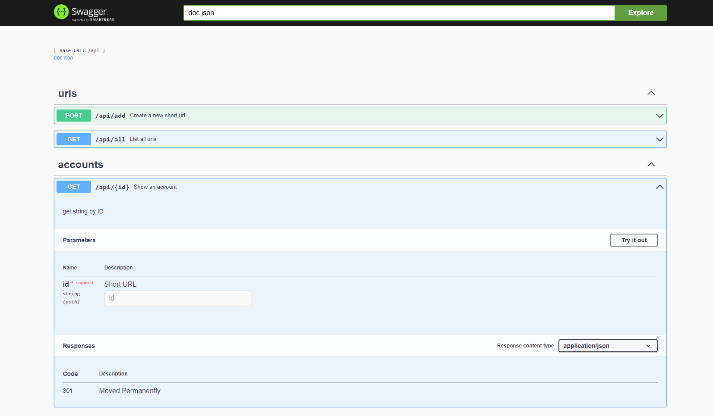

# Url Shortener

Url shortener API made with Go, Gin and Redis and documented with [Swagger](https://swagger.io/). Deploy to [Railway](https://railway.app) using [Redis Cloud](https://app.redislabs.com).



## Run

This project use default enviroment variables, redis addr is '127.0.0.1:6379' and other values are empty.
Unless other variables are found. Just exec:

```bash
go run .
```

The url for documentations is <http://localhost:8080/swagger/index.html>

## Tests

To run all tests in project exec:

```bash
go test ./...
```

## Endpoints

- GET   /:id     Redirect to original url.
- POST  /create  Create a new short url, if already exists returns previous url.

## Other

This project also have a gRPC version [here](https://github.com/Patrick564/url-shortener-backend).
